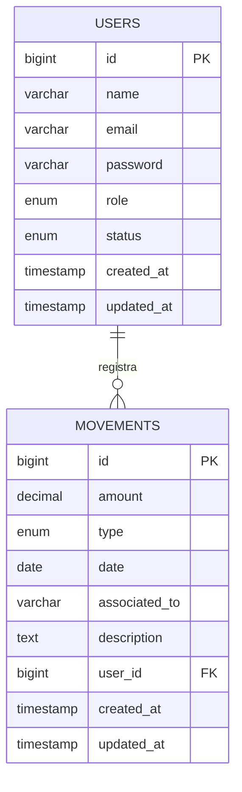

# Sistema Integral para el Control Financiero y Administrativo - Academia Conduser

## 📌 Enlace del Proyecto y Credenciales

El proyecto se encuentra desplegado y funcionando en producción. Puede acceder directamente desde el siguiente enlace:

- **Dominio de Acceso:** [https://gestion.csconduser.com/login](https://gestion.csconduser.com/login)

Para ingresar al sistema y validar sus funcionalidades, puede utilizar las siguientes credenciales de acceso general:

- **Usuario (Correo):** `root@conduser.com`
- **Contraseña:** `password123`
*(Si se generaron usuarios específicos en las pruebas Excel, puede usar esos también).*

---

## 👥 Equipo de Desarrollo y Soporte

Este proyecto fue planificado, desarrollado y entregado bajo una estructura ágil por el siguiente equipo. Todos los integrantes proporcionan el **soporte oficial** del sistema:

- **Juan Esteban Ospina** - *Product Owner* (Dueño del Producto, encargado de los requisitos y valor del negocio).
- **Sofia Vanegas** - *Scrum Master* (Líder ágil, encargada de la gestión del equipo y eliminación de impedimentos).
- **Kevin Quiroga** - *Desarrollador* (Encargado de la implementación de código, base de datos y backend).
- **Juan Jose Henao** - *Desarrollador* (Encargado de la implementación de código, interfaces y frontend).

**Fecha de Entrega:** 25 de Mayo de 2026

---

## 📁 Archivos para Revisión del Docente

Para la revisión académica de este proyecto, se han incluido y consolidado todos los entregables solicitados. El profesor debe revisar los siguientes archivos que se encuentran adjuntos en este repositorio:

1. **Diagramas Entidad-Relación (ER):**
   - Pueden encontrarse en el repositorio bajo los formatos de imagen exportados (ej. `diagrama_er.png`, `conduser_green_mockup...png`).
2. **Casos de Uso:**
   - La documentación de los diagramas de casos de uso y flujos del sistema.
3. **Base de Datos:**
   - Estructura y exportación en el archivo `database.sql` o en las migraciones de Laravel (`database/migrations/`).
4. **Pruebas Automatizadas y Manuales:**
   - **Excels de Pruebas:** Las sábanas de pruebas y resultados consolidados (archivos Excel `.xlsx`) que detallan las pruebas de calidad, estrés y flujos de usuario.
   - **Pruebas con GI y con las Imágenes:** Validaciones gráficas de interfaz, pruebas de responsividad (móvil vs PC) y comportamiento visual documentado.
5. **Capturas y Evidencias Visuales:**
   - Documentos de validación visual. En particular la imagen de evidencia:
     - `pruebas_screenshots/evidencia_documento.png` (Correspondiente a "Captura de pantalla 2026-05-25 a la(s) 7.37.51 p.m.")

---

## 🛠 Detalles Técnicos del Sistema

### Tecnologías Utilizadas
- **Backend:** Laravel 10 (PHP 8+)
- **Frontend:** Blade Templates, Tailwind CSS (Custom Design)
- **Base de Datos:** MySQL
- **Arquitectura:** MVC (Model-View-Controller)

### Roles del Sistema
El sistema cuenta con un control de acceso basado en roles para asegurar la trazabilidad financiera:
- **Root:** Control total del sistema, gestión de todos los usuarios y todos los movimientos.
- **Administrador:** Gestión financiera completa de la academia.
- **Colaborador:** Acceso limitado para registrar y visualizar únicamente sus propios gastos.

### Diagrama Entidad-Relación (Mermaid)

---

## 📸 Evidencia Adjunta Solicitada

A continuación se muestra el documento especificado para la revisión (`Captura de pantalla 2026-05-25 a la(s) 7.37.51 p.m.`):

---
*Fin del documento de entrega para la Academia Conduser.*
