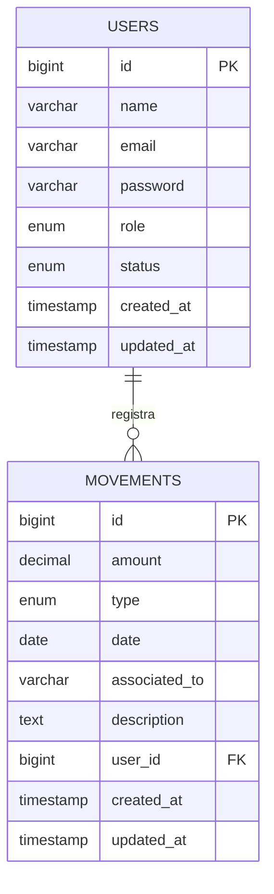

# Sistema Integral para el Control Financiero y Administrativo - Academia Conduser

## Descripción del Proyecto

El **Sistema Integral para el Control Financiero y Administrativo** es una aplicación web desarrollada para la Academia Conduser que permite gestionar usuarios, ingresos, egresos y movimientos financieros de manera eficiente y con trazabilidad completa.

Este sistema reemplaza el manejo manual en Excel y proporciona una plataforma centralizada para el control financiero con diferentes niveles de acceso según los roles de usuario.

## Tecnologías Utilizadas

- **Backend**: Laravel 10
- **Frontend**: Blade Templates + Bootstrap 5
- **Base de Datos**: MySQL
- **Autenticación**: Propia (implementación personalizada)
- **Control de Versiones**: Git
- **Arquitectura**: MVC (Model-View-Controller)

## Roles del Sistema

### 1. Root
- **Permisos**: Control total del sistema
- **Funcionalidades**:
  - Crear, editar, eliminar y activar/inactivar usuarios
  - Asignar roles (administrador, colaborador)
  - Ver todos los movimientos financieros
  - Acceso completo a todas las funcionalidades

### 2. Administrador
- **Permisos**: Gestión financiera completa
- **Funcionalidades**:
  - Registrar ingresos y egresos
  - Editar y eliminar movimientos
  - Filtrar movimientos por tipo y rango de fechas
  - Ver todos los movimientos del sistema

### 3. Colaborador
- **Permisos**: Gestión limitada a sus propios movimientos
- **Funcionalidades**:
  - Registrar únicamente egresos propios
  - Ver y editar solo sus movimientos
  - No puede registrar ingresos
  - No puede ver movimientos de otros usuarios

## Diagrama Entidad-Relación



## Estructura de la Base de Datos

### Tabla `users`
- **id**: Identificador único (Primary Key)
- **name**: Nombre completo del usuario
- **email**: Correo electrónico (único)
- **password**: Contraseña hasheada
- **role**: Rol del usuario (root, administrador, colaborador)
- **status**: Estado del usuario (activo, inactivo)
- **created_at**: Fecha de creación
- **updated_at**: Fecha de última actualización

### Tabla `movements`
- **id**: Identificador único (Primary Key)
- **amount**: Monto del movimiento (decimal, 10,2)
- **type**: Tipo de movimiento (ingreso, egreso)
- **date**: Fecha del movimiento
- **associated_to**: Entidad asociada (opcional)
- **description**: Descripción detallada
- **user_id**: ID del usuario que registra (Foreign Key)
- **created_at**: Fecha de creación
- **updated_at**: Fecha de última actualización

## Instalación

### Requisitos Previos
- PHP 8.1 o superior
- Composer
- MySQL 5.7 o superior
- Node.js y NPM (para compilar assets)

### Pasos de Instalación

1. **Clonar el repositorio**
   ```bash
   git clone <url-del-repositorio>
   cd conduser
   ```

2. **Instalar dependencias de PHP**
   ```bash
   composer install
   ```

3. **Instalar dependencias de Node.js**
   ```bash
   npm install
   ```

4. **Configurar entorno**
   ```bash
   cp .env.example .env
   php artisan key:generate
   ```

5. **Configurar base de datos**
   - Editar el archivo `.env` con los datos de conexión a MySQL
   - Crear la base de datos `conduser_academy`

6. **Ejecutar migraciones y seeders**
   ```bash
   php artisan migrate:fresh --seed
   ```

7. **Compilar assets**
   ```bash
   npm run build
   ```

8. **Iniciar el servidor**
   ```bash
   php artisan serve
   ```

## Usuario Root Inicial

El sistema crea automáticamente un usuario root con las siguientes credenciales:

- **Correo**: `root@conduser.com`
- **Contraseña**: `password123`
- **Rol**: `root`
- **Estado**: `activo`

## Funcionalidades Principales

### Autenticación
- Login y logout seguros
- Registro de nuevos usuarios (como colaborador por defecto)
- Bloqueo de usuarios inactivos
- Protección CSRF

### Gestión de Usuarios (Root)
- CRUD completo de usuarios
- Asignación de roles y estados
- Validaciones para evitar auto-eliminación
- Control de unicidad de correos

### Movimientos Financieros
- Registro de ingresos y egresos
- Edición y eliminación de movimientos
- Filtros por tipo y rango de fechas
- Trazabilidad de quién registra cada movimiento

### Dashboards Especializados
- Dashboard Root: Estadísticas de usuarios y gestión
- Dashboard Administrador: Control financiero completo
- Dashboard Colaborador: Gestión de egresos propios

## Comandos Útiles

### Desarrollo
```bash
# Iniciar servidor de desarrollo
php artisan serve

# Ver todas las rutas
php artisan route:list

# Limpiar caché
php artisan cache:clear
php artisan config:clear
php artisan view:clear
```

### Base de Datos
```bash
# Crear nueva migración
php artisan make:migration create_table_name

# Ejecutar migraciones
php artisan migrate

# Resetear base de datos
php artisan migrate:fresh --seed
```

## Validaciones y Seguridad

### Validaciones de Usuarios
- Nombre: Mínimo 3 caracteres
- Email: Formato válido y único
- Contraseña: Mínimo 8 caracteres (hasheada)
- Rol: Solo valores permitidos
- Estado: Solo valores permitidos

### Validaciones de Movimientos
- Monto: Numérico y mayor que cero
- Tipo: Solo ingreso o egreso
- Fecha: Formato válido
- Descripción: Mínimo 3 caracteres
- Usuario: Asignado automáticamente

### Medidas de Seguridad
- Contraseñas hasheadas con bcrypt
- Protección CSRF en formularios
- Middleware de autenticación y roles
- Validación de inputs del usuario
- Escapes de datos en vistas

## Capturas del Sistema (Evidencias de Pruebas)

*Nota: Guarda tus capturas de pantalla en una carpeta llamada `pruebas_screenshots` en la raíz de este proyecto con los nombres indicados abajo para que aparezcan aquí automáticamente.*

### 1. Pantalla de Login

- Mostrar el diseño dividido con logo Conduser y campos de credenciales.

### 2. Dashboard Root

- Lista de usuarios con acciones y estadísticas del sistema.

### 3. Dashboard Administrador

- Formulario de registro de movimientos y resumen financiero.

### 4. Dashboard Colaborador

- Formulario limitado a egresos y lista de movimientos propios.

### 5. CRUD de Usuarios

- Formulario de creación y tabla con acciones de edición/eliminación.

### 6. Movimientos con Filtros

- Lista de movimientos con filtros aplicados y resultados.

## Guía de Despliegue en Hostinger (Producción)

Para subir y desplegar este proyecto Laravel en un hosting compartido como Hostinger, sigue estos pasos:

### 1. Preparación Local
* Asegúrate de compilar los estilos y scripts ejecutando `npm run build` o `pnpm run build`.
* Comprime todo tu proyecto en un archivo `.zip`. **Importante:** Puedes excluir la carpeta `node_modules` (ya que no se necesita en producción) y los archivos `.env` (crearemos uno allá).

### 2. Subida de Archivos (hPanel)
* Entra al **Administrador de Archivos** de Hostinger.
* Sube tu archivo `.zip` a un nivel **superior** de la carpeta `public_html` (o dentro de ella si crearás una subcarpeta) y extráelo.

### 3. Configuración de la Carpeta Pública (Document Root)
* Por seguridad, Laravel requiere que solo la carpeta `public` sea accesible desde la web.
* En Hostinger, ve a la configuración de tu dominio o usa el Administrador de Archivos para **mover todo el contenido que está dentro de la carpeta `public` de Laravel directamente a la carpeta `public_html`** de Hostinger.
* Luego, abre el archivo `index.php` (que ahora está en `public_html`) y actualiza las rutas para que apunten al lugar donde pusiste el resto de Laravel. Ejemplo:
  ```php
  require __DIR__.'/../tu_carpeta_laravel/vendor/autoload.php';
  $app = require_once __DIR__.'/../tu_carpeta_laravel/bootstrap/app.php';
  ```

### 4. Base de Datos
* En hPanel, ve a **Bases de Datos MySQL** y crea una nueva base de datos, usuario y contraseña.
* Abre el archivo `.env` en Hostinger (puedes crear uno copiando `.env.example`) y configura:
  ```env
  DB_CONNECTION=mysql
  DB_HOST=127.0.0.1
  DB_PORT=3306
  DB_DATABASE=tu_base_datos_hostinger
  DB_USERNAME=tu_usuario_hostinger
  DB_PASSWORD=tu_contraseña_segura
  APP_URL=https://tudominio.com
  APP_ENV=production
  APP_DEBUG=false
  ```

### 5. Finalización
* Si tienes acceso **SSH** en Hostinger, abre la terminal allí y ejecuta: `php artisan migrate --seed` y `php artisan storage:link`.
* Si no tienes SSH, exporta la base de datos local desde tu computadora (con extensión `.sql`) e impórtala usando el **phpMyAdmin** de Hostinger.
* Revisa que las carpetas `storage` y `bootstrap/cache` tengan permisos de escritura (usualmente `755`).

## Estructura de Archivos

```
conduser/
├── app/
│   ├── Http/
│   │   ├── Controllers/
│   │   ├── Middleware/
│   └── Models/
├── database/
│   ├── migrations/
│   └── seeders/
├── resources/
│   └── views/
│       ├── auth/
│       ├── dashboards/
│       ├── users/
│       ├── movements/
│       └── layouts/
├── routes/
├── public/
├── docs/
├── README.md
├── database.sql
├── composer.json
└── package.json
```

## Licencia

Este proyecto es académico y fue desarrollado como parte de los requisitos de la Academia Conduser.

## Soporte

Para soporte técnico o preguntas sobre el sistema, contactar al equipo de desarrollo o revisar la documentación técnica en la carpeta `docs/`.

---

**Versión**: 1.0.0  
**Fecha de Entrega**: {{ date('d/m/Y') }}  
**Desarrollado para**: Academia Conduser
