<div align="center">
  <h1>🎓 Sistema Integral para el Control Financiero y Administrativo</h1>
  <h3>Proyecto / Desarrollo de Software - Academia Conduser</h3>
  <h3>Desplegado en https://gestion.csconduser.com/login  usuario root: conduserroot@gmail.com contraseña: Conduser@2005</h3>
  <p><em>Un ecosistema tecnológico robusto para la automatización, seguridad y trazabilidad de los flujos de caja y la gestión académica.</em></p>
</div>

<hr>

## 📑 Tabla de Contenido
1. [Resumen Ejecutivo e Introducción](#1-resumen-ejecutivo-e-introducción)
2. [Objetivos del Proyecto](#2-objetivos-del-proyecto)
3. [Requerimientos Funcionales y No Funcionales](#3-requerimientos-funcionales-y-no-funcionales)
4. [Equipo de Desarrollo y Metodología (Scrum)](#4-equipo-de-desarrollo-y-metodología-scrum)
5. [Despliegue Oficial y Credenciales (Producción)](#5-despliegue-oficial-y-credenciales-producción)
6. [Inventario Documental y Entregables (Auditoría)](#6-inventario-documental-y-entregables-auditoría)
7. [Arquitectura del Sistema y Tecnologías](#7-arquitectura-del-sistema-y-tecnologías)
8. [Diseño de Base de Datos y Modelo Relacional](#8-diseño-de-base-de-datos-y-modelo-relacional)
9. [Manual de Usuario Básico](#9-manual-de-usuario-básico)
10. [Seguridad y Gestión de Accesos (RBAC)](#10-seguridad-y-gestión-de-accesos-rbac)
11. [Estrategia de Pruebas Automatizadas y QA](#11-estrategia-de-pruebas-automatizadas-y-qa)
12. [Evidencias Visuales y Validaciones (GIFs E2E)](#12-evidencias-visuales-y-validaciones-gifs-e2e)
13. [Guía de Instalación en Desarrollo](#13-guía-de-instalación-en-desarrollo)

---

## 1. Resumen Ejecutivo e Introducción
La **Academia Conduser** requería con urgencia la modernización de sus procesos de control interno, los cuales se venían llevando de manera manual a través de hojas de cálculo descentralizadas. Este proyecto consistió en el ciclo de vida completo (análisis, diseño, desarrollo, pruebas y despliegue) de un sistema web escalable y seguro. 

El sistema centraliza la gestión de usuarios, la auditoría de entradas y salidas de dinero, el cálculo de nómina (comisiones y descuentos) y genera reportes en tiempo real para la correcta toma de decisiones gerenciales. Todo esto bajo una estricta arquitectura orientada a la seguridad de la información.

**Fecha de Entrega:** 25 de Mayo de 2026

---

## 2. Objetivos del Proyecto

### Objetivo General
Diseñar, desarrollar e implementar una plataforma web centralizada para la automatización integral de la gestión administrativa, el control financiero y la trazabilidad operativa de la Academia Conduser, reduciendo el margen de error humano y garantizando la integridad de los datos institucionales.

### Objetivos Específicos
- Migrar los registros financieros en hojas de cálculo a una base de datos relacional robusta (MySQL).
- Desarrollar un sistema de autenticación seguro con control de acceso basado en roles (RBAC).
- Implementar una interfaz de usuario (UI) moderna, altamente responsiva y amigable (UX).
- Establecer un sistema automatizado de Pruebas de Calidad (QA) para certificar la estabilidad de los flujos.
- Desplegar el sistema final en un servidor en la nube garantizando una disponibilidad de 24/7.

---

## 3. Requerimientos Funcionales y No Funcionales

### Requerimientos Funcionales
- **RF-01 (Autenticación):** El sistema debe permitir el inicio y cierre de sesión seguro mediante correo y contraseña.
- **RF-02 (CRUD de Usuarios):** Un administrador debe poder crear, listar, modificar y eliminar personal de la academia.
- **RF-03 (Registro Financiero):** El sistema debe permitir el registro de flujos de caja (ingresos y egresos).
- **RF-04 (Restricción por Rol):** Los colaboradores comunes solo deben tener permisos para visualizar y registrar sus propios egresos.
- **RF-05 (Auditoría):** Toda acción crítica dentro del sistema debe registrar fecha, hora y usuario ejecutor.

### Requerimientos No Funcionales
- **RNF-01 (Seguridad):** Las contraseñas deben almacenarse bajo el algoritmo de encriptación Bcrypt. Protección obligatoria contra CSRF y SQL Injection.
- **RNF-02 (Usabilidad):** El sistema debe adaptarse a pantallas de teléfonos móviles, tablets y computadoras (Responsive Design 100%).
- **RNF-03 (Rendimiento):** El tiempo máximo de respuesta del servidor en peticiones de consulta no debe exceder los 2 segundos.
- **RNF-04 (Disponibilidad):** El sistema estará hosteado y desplegado de manera continua.

---

## 4. Equipo de Desarrollo y Metodología (Scrum)

El proyecto se gestionó bajo la **Metodología Ágil Scrum**, operando en Sprints estructurados para garantizar entregas incrementales de alto valor. **El soporte oficial del sistema lo provee exclusivamente este equipo.**

- 💼 **Juan Esteban Ospina - *Product Owner (Dueño del Producto)***
  Representante del cliente. Definió las historias de usuario, priorizó el Product Backlog y fue responsable de validar que el software construido solucionara los dolores comerciales y financieros reales de la Academia.
- ⏱️ **Sofia Vanegas - *Scrum Master***
  Líder ágil. Responsable de garantizar el cumplimiento del marco Scrum, moderar ceremonias (Daily Standups, Plannings, Retrospectives) y mitigar bloqueos o impedimentos externos para que el equipo de desarrollo operara con fluidez técnica.
- ⚙️ **Kevin Quiroga - *Desarrollador (Backend, BD & Automatización)***
  Encargado de la lógica de negocio sólida. Diseñó el diagrama relacional, programó las migraciones en Laravel, construyó las APIS internas, el middleware de seguridad y orquestó la automatización de pruebas End-to-End utilizando Selenium y Python.
- 🎨 **Juan José Henao - *Desarrollador (Frontend & UI/UX)***
  Encargado de la experiencia de usuario. Su responsabilidad fue convertir los mockups iniciales en plantillas de Blade interactivas y responsivas, integrando tecnologías como Tailwind CSS y AlpineJS para las animaciones y vistas.

---

## 5. Despliegue Oficial y Credenciales (Producción)

El sistema ya fue llevado a producción, configurado correctamente sobre un entorno Linux con un servidor web optimizado para Laravel.

- 🔗 **Dominio de Acceso:** [https://gestion.csconduser.com/login](https://gestion.csconduser.com/login)

Para auditar el sistema en su totalidad (módulos, configuraciones y usuarios), utilice las siguientes credenciales:
- **Usuario Root (Máximos privilegios):** `conduserroot@gmail.com`
- **Contraseña Root:** `Conduser@2005`

Para validar que el Control de Accesos por Roles (RBAC) restringe correctamente las pantallas y funcionalidades, utilice los usuarios de prueba:
- **Usuario Administrador:** `admin@conduser.com` (Clave: `Admin123`)
- **Usuario Colaborador:** `colaborador@conduser.com` 

---

## 6. Inventario Documental y Entregables (Auditoría)

Toda la trazabilidad de ingeniería de software requerida para calificación ha sido consolidada estructuralmente dentro de este repositorio:

### Carpeta `docs/` (Arquitectura e Ingeniería)
- 📄 **`casos_uso.md`**: Especificación formal paso a paso de los Casos de Uso del sistema, precondiciones y flujos principales.
- 📄 **`diagramas_flujo.md`**: Diagramas interactivos (Mermaid) mostrando el ciclo de vida de la autenticación y las peticiones Middleware.
- 📄 **`entradas_salidas.md`**: Diccionario formal especificando qué parámetros de entrada requiere el sistema y sus salidas esperadas.
- 📄 **`DIAGRAMA_ENTIDAD_RELACION.md`**: Topología estructural de la base de datos en formato gráfico y textual.
- 📄 **`Casos_Pruebas_Software.tex`**: Entregable académico formal (LaTeX) estructurando las métricas de calidad de software.
- 🖼️ **`conduser_mockup.png`** / **`mockup_layout.json`**: Evidencias de la fase de prototipado inicial (Balsamiq/Figma) previo al código.
- 📄 **`INFORME_PRUEBAS.md`**: Resumen general de las pruebas de QA.

### Carpeta `pruebas_finales/` (Quality Assurance & Automation)
- 📊 **`resultados_pruebas_automatizadas.xlsx`**: Sábana maestra de validación donde constan los resultados de las pruebas de carga, pruebas de integración y flujos manuales. (Documento fundamental para revisión docente).
- 🤖 **`selenium_qa_automation.py`**: El código fuente (Script de Python) con el que se corrieron las simulaciones automatizadas de usuarios.
- 🎥 **Carpeta `videos/`**: Almacena las grabaciones `.gif` del bot ejecutando clics automatizados para validar que la UI funciona correctamente.

---

## 7. Arquitectura del Sistema y Tecnologías

El sistema sigue una arquitectura de **Modelo-Vista-Controlador (MVC)**, lo cual garantiza una completa separación entre la interfaz de usuario, la lógica de la aplicación y el acceso a los datos.

- **Lenguaje Base:** PHP 8.1+
- **Framework Core:** Laravel 10 (Encargado del ruteo, ORM Eloquent, Inyección de Dependencias).
- **Capa Visual (Frontend):** Laravel Blade acoplado dinámicamente con Vite (para compilación súper rápida). Se utiliza **Tailwind CSS** y **Bootstrap 5** combinados para lograr interfaces estéticas, tarjetas neumórficas y degradados dinámicos.
- **Motor de Base de Datos:** MySQL Relacional (Índices optimizados para consultas financieras).
- **QA Automation:** Python 3 + Selenium WebDriver.

---

## 8. Diseño de Base de Datos y Modelo Relacional

La base de datos (diagramada en `docs/DIAGRAMA_ENTIDAD_RELACION.md`) consta de un ecosistema altamente acoplado por llaves foráneas. Su corazón se centra en dos entidades masivas:

1. **Tabla `users`:** Almacena todos los colaboradores. Además de credenciales seguras, define obligatoriamente un campo enumerado `role` (`root`, `administrador`, `colaborador`) que dicta qué partes de la base de datos puede tocar el sujeto.
2. **Tabla `movements`:** Registra la contabilidad. Cada movimiento (`type`: ingreso o egreso) debe estar estrictamente ligado (mediante `user_id`) a la persona que realizó la inserción, cumpliendo el principio de auditoría financiera.

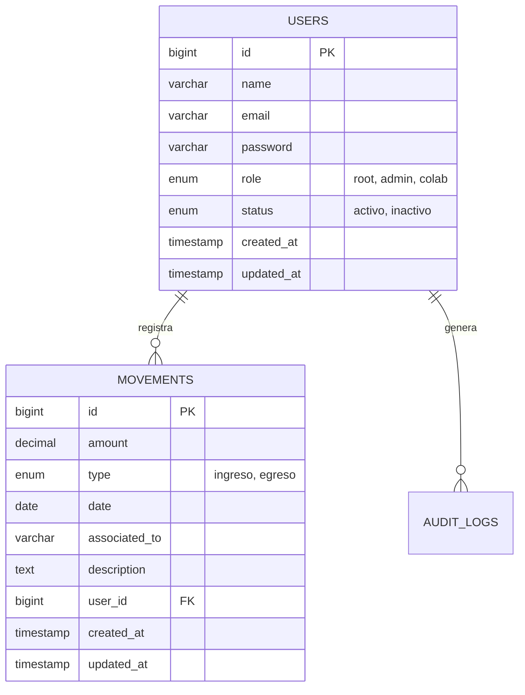

---

## 9. Manual de Usuario Básico

1. **Acceso:** Navegue hacia `https://gestion.csconduser.com` (Será redirigido al login).
2. **Autenticación:** Ingrese su correo institucional y su contraseña secreta asignada.
3. **Navegación del Dashboard:** Al ingresar, la barra lateral le mostrará a qué módulos tiene acceso.
4. **Gestión de Personal (Solo Root/Admin):** Desde la sección "Usuarios", haga clic en "Nuevo" para enrolar empleados, o en el icono del basurero para darlos de baja.
5. **Transacciones:** Diríjase al módulo de Movimientos. Elija "Ingreso" o "Egreso", digite el valor exacto y añada una descripción obligatoria (ej: *Pago servicio de internet*). Guarde la operación y su transacción quedará en la nube blindada con su nombre como autor.

---

## 10. Seguridad y Gestión de Accesos (RBAC)

La plataforma es completamente impermeable a ataques básicos de internet:
- **Protección CSRF:** Cada formulario inyecta un Token Único (`@csrf`) evitando falsificación de peticiones en otros sitios.
- **Middlewares Protectores:** Todas las rutas, excepto el login, están cubiertas por una cortina de seguridad. Si un usuario no logueado intenta escribir la URL `/dashboard`, el middleware de Laravel abortará el intento con un Error 401 y lo expulsará.
- **Hashing Criptográfico:** Nunca se almacena una contraseña en texto plano; todo atraviesa el algoritmo Bcrypt de un solo sentido.

---

## 11. Estrategia de Pruebas Automatizadas y QA

El equipo de QA garantizó que la plataforma está libre de "bugs" críticos. Para ello se utilizaron las siguientes métricas y entregables, todos comprobables en la carpeta `pruebas_finales/`:

- **Pruebas Funcionales Automatizadas (E2E):** Un script robótico de Selenium navega por el sistema llenando formularios, inyectando contraseñas incorrectas y simulando comportamientos destructivos, verificando que el sistema siempre arroje las alertas correctas y proteja los datos.
- **Validaciones de Diseño de Interfaz (GI):** Comprobación en paralelo de cómo se renderizan los colores, degradados y disposición de cajas en un monitor Desktop de 1080p frente a un dispositivo móvil vertical, asegurando que la experiencia nunca se degrade.

---

## 12. Evidencias Visuales y Validaciones (GIFs E2E)

A continuación, exponemos abiertamente los resultados documentados y videograbados (GIF) de los Casos de Prueba (CP) automatizados superando la auditoría de calidad.

### 📸 Evidencia Específica de Diseño Solicitada
La siguiente imagen fue exigida explícitamente como evidencia documental de la superposición de la interfaz de diseño validada en producción:
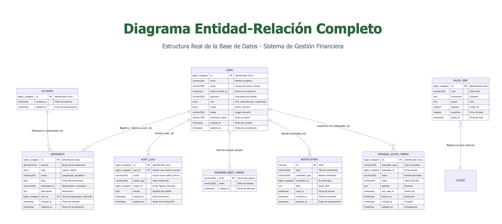

### 📸 Prototipo / Mockup Original
Validación del plan de diseño frente a lo construido en código.
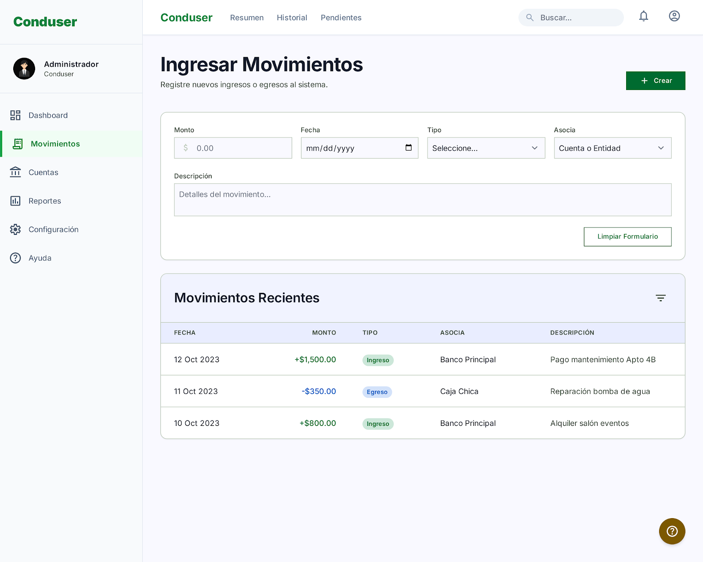
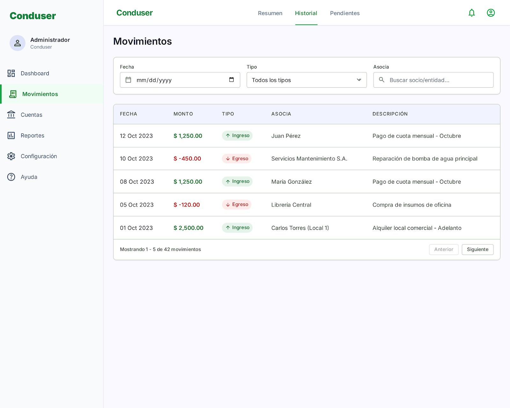
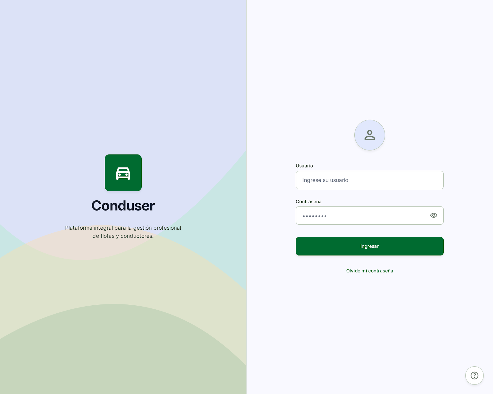
### 🎥 Validaciones de Comportamiento Dinámico (Selenium Automation)

#### Panel de Autenticación
- **CP-01 Inicio de Sesión Exitoso:**
  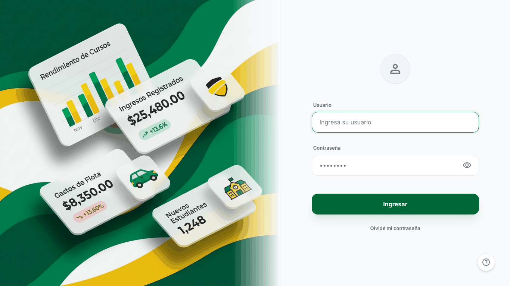
- **CP-02 Intercepción de Login Erróneo:**
  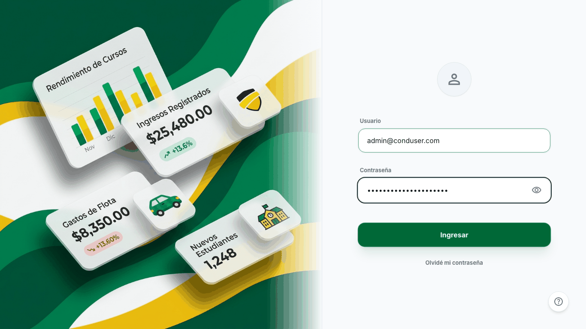

#### Gestión y Manipulación de Base de Usuarios (Root)
- **CP-03 Inserción de Nuevo Empleado:**
  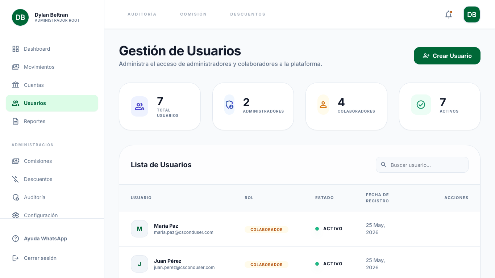
- **CP-04 Remoción Forzada de Cuenta:**
  

#### Integridad Financiera y Bloqueos de Transacción
- **CP-05 Afectación de Caja (Ingreso Positivo):**
  
- **CP-06 Rechazo de Valores Ilógicos (Monto Inválido):**
  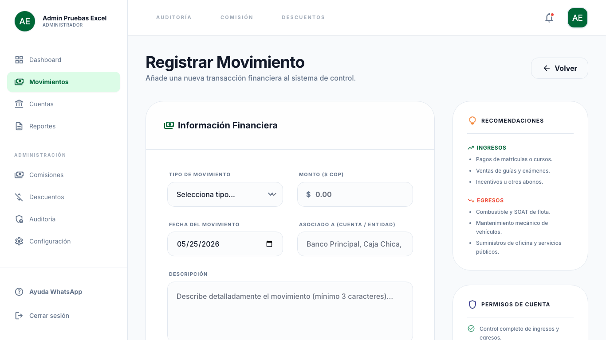
- **CP-07 Reporte de Egresos:**
  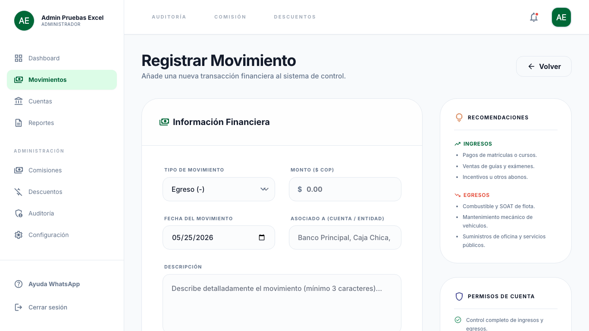
- **CP-08 Restricción Verificada del Rol Colaborador:**
  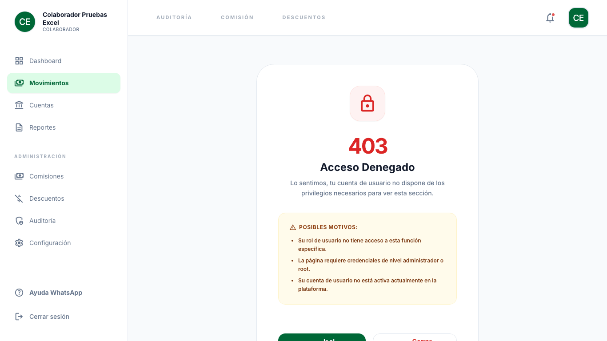
- **CP-09 / CP-10 Listados y Búsquedas por Filtros Temporales:**
  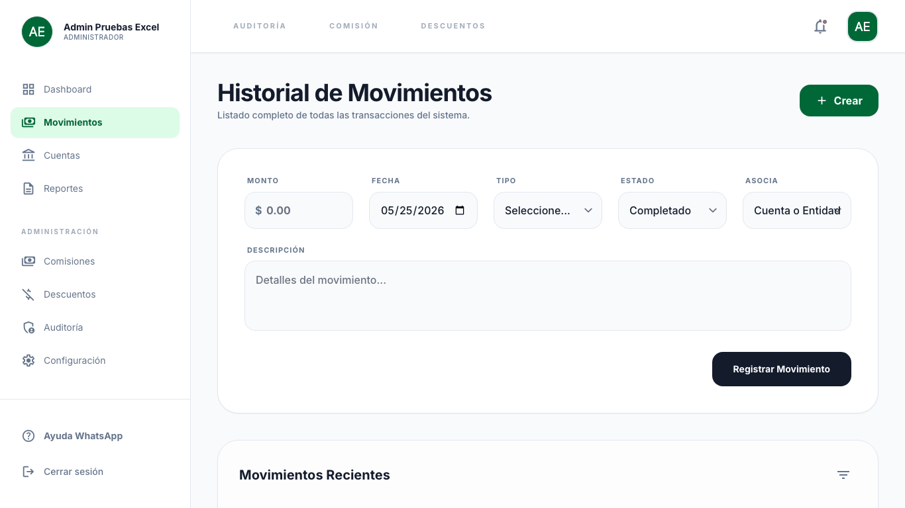
  

---

## 13. Guía de Instalación en Desarrollo

Para probar el código fuente de forma local (desconectado del servidor Hostinger), un ingeniero debe correr las siguientes rutinas en su consola:

1. **Obtener el Código:** `git clone https://github.com/jeom0/SistemaGestionAcademia.git`
2. **Entrar al directorio:** `cd SistemaGestionAcademia`
3. **Instalar el Vendor PHP:** `composer install`
4. **Instalar Dependencias de Node:** `npm install`
5. **Configurar el Archivo Ambiental:** `cp .env.example .env` y generar firma con `php artisan key:generate`
6. **Migrar la BD Local (Previamente encender MySQL):** `php artisan migrate:fresh --seed`
7. **Empaquetar los assets de diseño y levantar el servidor:** 
   ```bash
   npm run build
   php artisan serve
   ```
8. Ingrese a su navegador en `http://localhost:8000`.

---
<div align="center">
  <p><strong>Desarrollado con Excelencia Técnica.</strong></p>
  <p><em>© 2026 Equipo de Ingeniería - Academia Conduser. Todos los derechos reservados.</em></p>
</div>
