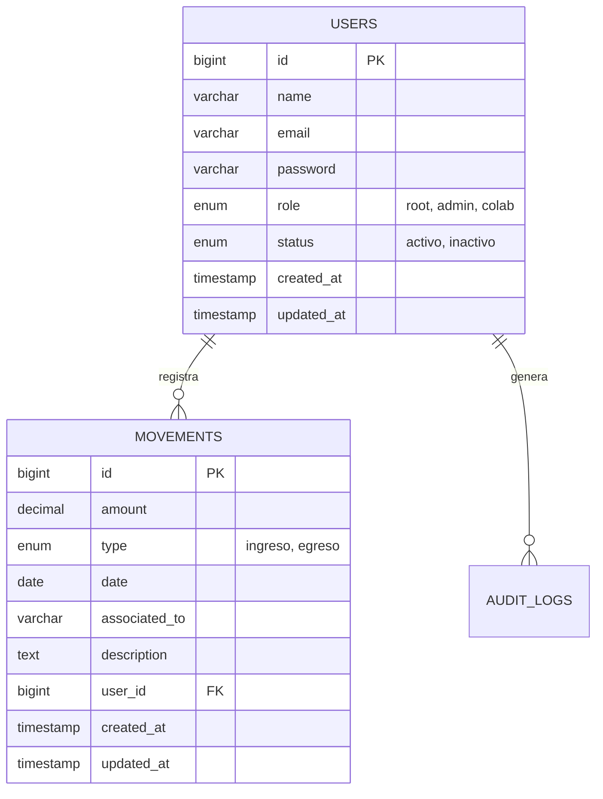
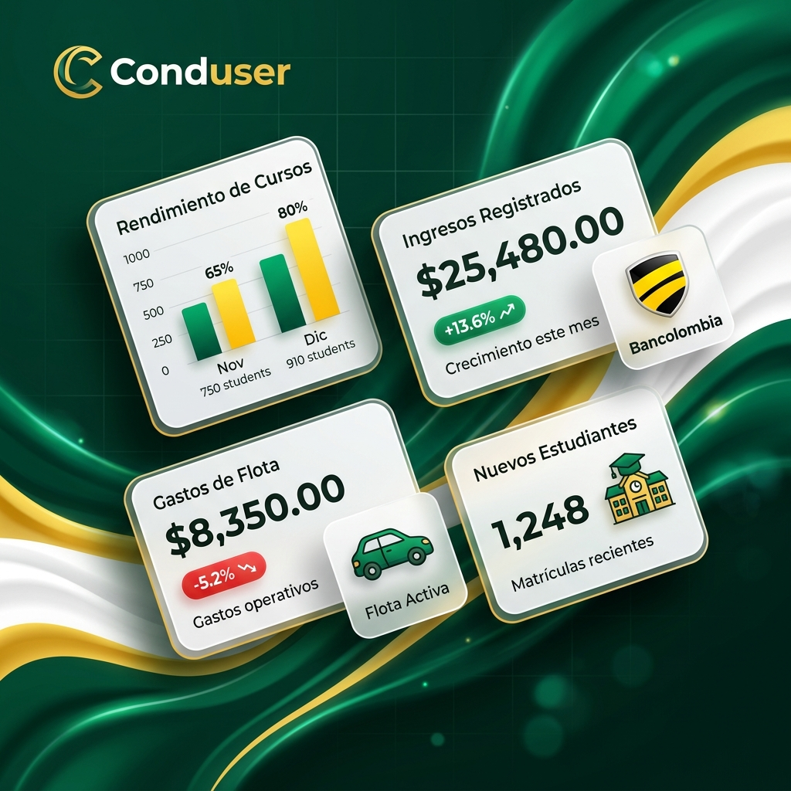

# Sistema Integral para el Control Financiero y Administrativo - Academia Conduser

Bienvenido al repositorio oficial del **Sistema Integral para el Control Financiero y Administrativo de la Academia Conduser**. Este documento consolida toda la información necesaria para la evaluación académica, despliegue en producción y uso del sistema.

Este proyecto tiene como objetivo transformar y digitalizar la gestión financiera de la academia, reemplazando el control manual y propenso a errores (llevado en hojas de Excel) por una plataforma web segura, automatizada, con trazabilidad completa y centralizada bajo una arquitectura moderna.

---

## 📅 Información de la Entrega Final

- **Fecha de Entrega Oficial:** 25 de Mayo de 2026
- **Entidad / Cliente:** Academia Conduser
- **Versión del Sistema:** 1.0.0 (Release Candidate)

---

## 👥 Equipo de Trabajo (Roles Ágiles Oficiales)

El proyecto fue planificado, desarrollado y desplegado utilizando el marco de trabajo ágil Scrum. A continuación, se presentan los integrantes del equipo de desarrollo, quienes son los únicos encargados de brindar **soporte técnico oficial** para el sistema:

1. **Juan Esteban Ospina** - *Product Owner (Dueño del Producto)*
   Encargado de maximizar el valor del producto, gestionar y priorizar el Product Backlog. Responsable de asegurar que los requisitos del sistema se alineen perfectamente con las necesidades comerciales e institucionales de la academia.

2. **Sofia Vanegas** - *Scrum Master*
   Líder servicial encargada de promover y apoyar la metodología Scrum. Responsable de asegurar que el equipo entienda los objetivos, moderar las ceremonias (Dailies, Sprint Plannings, Retrospectives) y eliminar cualquier impedimento técnico o de comunicación que bloquee al equipo.

3. **Kevin Quiroga** - *Desarrollador (Backend & Base de Datos)*
   Especialista en lógica de negocio. Encargado del desarrollo estructural en Laravel, diseño del modelo relacional en MySQL, seguridad, roles, middleware y la creación del script de automatización de pruebas (`selenium_qa_automation.py`).

4. **Juan José Henao** - *Desarrollador (Frontend & UI/UX)*
   Especialista en interfaces e interacción de usuario. Encargado de transformar los mockups en vistas funcionales (Blade Templates + Bootstrap/Tailwind), asegurar la responsividad en dispositivos móviles e implementar los flujos visuales que garantizan una experiencia de usuario premium.

---

## 🚀 Acceso al Sistema en Producción

El proyecto se encuentra totalmente desplegado y accesible a través de internet en un servidor Hostinger. Para validar el funcionamiento del sistema en vivo, por favor acceda al siguiente enlace:

- **🔗 Dominio Principal:** [https://gestion.csconduser.com/login](https://gestion.csconduser.com/login)

### Credenciales de Ingreso (Para Pruebas del Docente)
Para auditar la plataforma con privilegios totales y tener acceso a todos los módulos (Gestión de usuarios, auditoría, finanzas, nómina), utilice las credenciales maestras:
- **Usuario Root (Máximos privilegios):** `conduserroot@gmail.com`
- **Contraseña Root:** `Conduser@2005`

Además, para evaluar la restricción de vistas y el Control de Acceso Basado en Roles (RBAC), hemos preconfigurado los siguientes usuarios de prueba:
- **Usuario Administrador:** `admin@conduser.com` (Contraseña: `Admin123`)
- **Usuario Colaborador:** `colaborador@conduser.com` (Contraseña: `Colaborador123` o equivalente según BD)

---

## 📁 Guía Exhaustiva de Documentos y Entregables (Auditoría)

Para facilitar la calificación exhaustiva del proyecto, hemos consolidado todos los entregables requeridos en carpetas específicas del repositorio. El profesor debe revisar las siguientes secciones:

### 1. Documentación Arquitectónica y Diseño (Carpeta `docs/`)
Toda la planeación y estructura de ingeniería de software se encuentra aquí:
- 📄 `docs/casos_uso.md` - Documentación formal que describe paso a paso los **Casos de Uso** principales del sistema (Autenticación, Middleware, Roles).
- 📄 `docs/diagramas_flujo.md` - Documentación técnica con **Diagramas de Flujo (Mermaid)** ilustrando el ciclo de vida y la interacción del sistema de autenticación.
- 📄 `docs/entradas_salidas.md` - Especificación detallada de **Entradas y Salidas** (parámetros y respuestas) de los módulos del sistema.
- 📄 `docs/DIAGRAMA_ENTIDAD_RELACION.md` - Especificación completa de las tablas, campos y el **Diagrama Entidad-Relación** del modelo de datos.
- 📄 `docs/Casos_Pruebas_Software.tex` - Documentación formal (formato LaTeX) detallando escenarios de pruebas de software.
- 📄 `docs/INFORME_PRUEBAS.md` - Informe técnico detallando la estrategia de calidad de software.
- 🖼️ `docs/conduser_mockup.png` y `mockup_layout.json` - Prototipos iniciales de interfaz y diseño (UI/UX) que sirvieron de base para el desarrollo.
- 👨‍💻 `docs/test_integration.php` - Script de validación de integración.

### 2. Pruebas de Calidad, QA y Automatización (Carpeta `pruebas_finales/`)
El sistema fue sometido a pruebas funcionales, pruebas de UI con Interfaz Gráfica (GI) y pruebas de flujo completas:
- 📊 **`pruebas_finales/resultados_pruebas_automatizadas.xlsx`** - (IMPORTANTE) Es el archivo Excel principal que contiene la **sábana de pruebas** automatizadas y manuales requeridas para la revisión.
- 📊 `pruebas_finales/resultados_pruebas.csv` - Registro crudo de los resultados de testing.
- 📄 `pruebas_finales/Informe_Pruebas_Finales.md` - Conclusiones de la auditoría final y métricas de éxito.
- 🤖 `pruebas_finales/selenium_qa_automation.py` - Script en Python desarrollado por el equipo utilizando Selenium WebDriver para realizar automatización de pruebas E2E (End-to-End) en los flujos principales.
- 🎥 `pruebas_finales/videos/` - Carpeta que contiene evidencia en **video** de las automatizaciones corriendo y del software en funcionamiento.

### 3. Evidencias Visuales Específicas (Carpeta `pruebas_screenshots/`)
- 🖼️ `pruebas_screenshots/evidencia_documento.png` - Evidencia de la validación visual y diseño exigido. (Corresponde exactamente al archivo solicitado `Captura de pantalla 2026-05-25 a la(s) 7.37.51 p.m.`). 
*(Se puede previsualizar esta imagen al final de este README).*

---

## 🛠 Arquitectura y Tecnologías del Sistema

El ecosistema tecnológico elegido garantiza un rendimiento rápido, seguridad y escalabilidad para la Academia:
- **Backend Framework:** Laravel 10 (PHP 8.1+)
- **Frontend Core:** Blade Templates impulsados por Vite.
- **Estilos e UI:** Bootstrap 5 y Tailwind CSS combinados para interfaces modulares y diseños fluidos.
- **Base de Datos:** MySQL (con migraciones y seeders integrados en Laravel).
- **Control de Versiones y Despliegue:** Git y GitHub.

### Módulos Principales
1. **Módulo de Autenticación:** Login seguro con encriptación bcrypt, protección CSRF y redirección automática.
2. **Módulo de Usuarios:** Gestión completa de colaboradores (CRUD).
3. **Módulo Financiero:** Control de Ingresos y Egresos.
4. **Módulo de Nómina:** Cálculo de comisiones y descuentos del personal.
5. **Módulo de Auditoría:** Trazabilidad de qué usuario y a qué hora realiza cada acción dentro del sistema.

### Control de Acceso Basado en Roles (RBAC)
- **Root:** Administrador del sistema. Tiene control total sobre el CRUD de usuarios, nómina, reportes y auditoría global.
- **Administrador:** Encargado operativo. Gestiona finanzas, ingresos, egresos y puede ver los reportes comerciales, pero no puede crear/eliminar cuentas.
- **Colaborador:** Nivel operativo base. Únicamente puede registrar sus propios gastos operativos y ver su propio historial, garantizando la privacidad de la empresa.

---

## 📊 Diagrama Entidad-Relación (Estructura Core)

La base de datos cuenta con una integridad relacional fuerte para rastrear qué usuario es responsable de cada movimiento.



---

## ⚙️ Instrucciones de Despliegue Local (Para Evaluación)

En caso de requerir auditar el código corriendo de manera local, ejecute la siguiente guía paso a paso:

1. **Clonar el proyecto:**
   ```bash
   git clone https://github.com/jeom0/SistemaGestionAcademia.git
   cd SistemaGestionAcademia
   ```
2. **Instalar dependencias del servidor y de interfaz:**
   ```bash
   composer install
   npm install
   ```
3. **Configurar las variables de entorno:**
   ```bash
   cp .env.example .env
   php artisan key:generate
   ```
4. **Migrar la Base de Datos e inyectar el usuario Root:**
   *(Asegúrese de haber creado una base de datos MySQL local y conectarla en su .env primero).*
   ```bash
   php artisan migrate:fresh --seed
   ```
5. **Compilar el frontend y encender el servidor PHP:**
   ```bash
   npm run build
   php artisan serve
   ```
El sistema estará disponible en `http://localhost:8000`.

---

## 📸 Evidencias Visuales y Pruebas Automatizadas (GIFs)

A continuación, presentamos los resultados visuales de los **Flujos de Pruebas Automatizadas** ejecutados por Selenium, demostrando el correcto funcionamiento End-to-End (E2E) de la plataforma, así como las validaciones gráficas exigidas:

### 1. Evidencia Solicitada (Validación Gráfica de Interfaz)
Esta imagen fue requerida específicamente para la validación visual y responsividad de la página de inicio de sesión de Conduser.


### 2. Mockup Inicial (Base de Diseño)


### 3. Ejecución de Casos de Prueba (Videos/GIFs de Selenium)

A continuación, los flujos automatizados demostrando el comportamiento real del sistema en vivo:

#### Módulo de Autenticación
- **CP-01 Login Exitoso:**
  
- **CP-02 Login Fallido:**
  

#### Módulo de Gestión de Usuarios (Root)
- **CP-03 Crear Usuario:**
  
- **CP-04 Eliminar Usuario:**
  

#### Módulo Financiero (Administrador y Colaborador)
- **CP-05 Registrar Ingreso:**
  
- **CP-06 Validación de Monto (Manejo de Errores):**
  
- **CP-07 Registrar Egreso:**
  
- **CP-08 Restricción Gasto Colaborador:**
  
- **CP-09 Ver Movimientos:**
  
- **CP-10 Filtrar Movimientos:**
  

---
*© 2026 Academia Conduser. Desarrollo de Software Universitario.*
