# Diagrama Entidad-Relación Completo (ERD) - Academia Conduser

El siguiente diagrama muestra el **100% del sistema de bases de datos** (8 tablas) con todas sus conexiones y llaves foráneas (*Foreign Keys*).

> **Nota:** GitHub renderiza este diagrama automáticamente como una imagen.

```mermaid
erDiagram
    USERS {
        bigint_unsigned id PK "Identificador único"
        varchar(255) name "Nombre completo"
        varchar(255) email "Correo electrónico (Único)"
        timestamp email_verified_at "Fecha de verificación"
        varchar(255) password "Contraseña encriptada"
        enum role "root, administrador, colaborador"
        enum status "activo, inactivo"
        varchar(255) avatar "Imagen de perfil"
        varchar(100) remember_token "Token de sesión"
        timestamp created_at "Fecha de creación"
        timestamp updated_at "Fecha de actualización"
    }

    MOVEMENTS {
        bigint_unsigned id PK "Identificador único"
        decimal(10x2) amount "Monto de la transacción"
        enum type "ingreso, egreso"
        varchar(255) status "completado, pendiente"
        date date "Fecha del movimiento"
        varchar(255) associated_to "Relacionado a (concepto)"
        text description "Descripción"
        bigint_unsigned user_id FK "Usuario responsable o afectado"
        timestamp created_at "Fecha de creación"
        timestamp updated_at "Fecha de actualización"
    }

    AUDIT_LOGS {
        bigint_unsigned id PK "Identificador único"
        bigint_unsigned user_id FK "Usuario que realizó la acción"
        varchar(255) action "Acción (crear, editar, borrar)"
        varchar(255) model_type "Tabla modificada"
        bigint_unsigned model_id "ID del registro afectado"
        text details "Detalles del cambio"
        timestamp created_at "Fecha del evento"
        timestamp updated_at "Fecha de actualización"
    }

    NOTIFICATIONS {
        char(36) id PK "UUID"
        varchar(255) type "Tipo de notificación"
        varchar(255) notifiable_type "Modelo notificable"
        bigint_unsigned notifiable_id "ID notificable"
        text data "Datos JSON"
        timestamp read_at "Fecha de lectura"
        timestamp created_at "Fecha de creación"
        timestamp updated_at "Fecha de actualización"
    }

    ACCOUNTS {
        bigint_unsigned id PK "Identificador único"
        timestamp created_at "Fecha de creación"
        timestamp updated_at "Fecha de actualización"
    }

    PASSWORD_RESET_TOKENS {
        varchar(255) email PK "Correo del usuario"
        varchar(255) token "Token de reseteo"
        timestamp created_at "Fecha de solicitud"
    }

    FAILED_JOBS {
        bigint_unsigned id PK "Identificador único"
        varchar(255) uuid "UUID único"
        text connection "Conexión"
        text queue "Cola"
        longtext payload "Carga útil"
        longtext exception "Error arrojado"
        timestamp failed_at "Fecha de fallo"
    }

    PERSONAL_ACCESS_TOKENS {
        bigint_unsigned id PK "Identificador único"
        varchar(255) tokenable_type "Tipo de entidad"
        bigint_unsigned tokenable_id "ID de entidad"
        varchar(255) name "Nombre del token"
        varchar(64) token "Token SHA-256"
        text abilities "Permisos"
        timestamp last_used_at "Último uso"
        timestamp expires_at "Expiración"
        timestamp created_at "Creación"
        timestamp updated_at "Actualización"
    }

    %% Relaciones (Foreign Keys y Relaciones Lógicas Polymorficas)
    USERS ||--o{ MOVEMENTS : "Registra / Afecta a (user_id)"
    USERS ||--o{ AUDIT_LOGS : "Genera (user_id)"
    USERS ||--o| PASSWORD_RESET_TOKENS : "Solicita reseteo (email)"
    USERS ||--o{ NOTIFICATIONS : "Recibe (notifiable_id)"
    USERS ||--o{ PERSONAL_ACCESS_TOKENS : "Autentica con (tokenable_id)"
    ACCOUNTS ||--o{ MOVEMENTS : "Pertenece a (associated_to)"
    FAILED_JOBS }o--|| SYSTEM : "Registra errores internos"
```

## Resumen de Relaciones (Estructura de Red)
- **Tabla Central:** `users`. Esta es la tabla núcleo de la aplicación, ya que maneja los roles (root, administrador, colaborador) y de ella se desprenden los registros críticos.
- **Movimientos:** Relacionado de 1-a-Muchos con usuarios. Cada registro financiero siempre está atado a un empleado responsable o involucrado.
- **Auditoría:** Cada movimiento o edición en el sistema deja una huella ligada siempre al usuario, garantizando total transparencia financiera.
- **Tablas de Sistema:** Notificaciones, Tokens de Sesión y Tokens de Recuperación giran en torno al usuario para su seguridad y autenticación.
