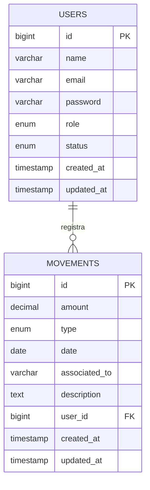

# Diagrama Entidad-Relación - Sistema Academia Conduser

## Descripción General

El Sistema Integral para el Control Financiero y Administrativo de la Academia Conduser utiliza una arquitectura de base de datos relacional simple pero eficiente, compuesta por dos tablas principales que permiten gestionar usuarios y movimientos financieros con trazabilidad completa.

## Tablas del Sistema

### 1. Tabla `users`

**Propósito**: Almacenar la información de los usuarios del sistema con sus roles y permisos.

**Campos**:
- `id` (bigint, Primary Key): Identificador único del usuario
- `name` (varchar): Nombre completo del usuario
- `email` (varchar, Unique): Correo electrónico único para autenticación
- `password` (varchar): Contraseña hasheada con bcrypt
- `role` (enum): Rol del usuario ('root', 'administrador', 'colaborador')
- `status` (enum): Estado del usuario ('activo', 'inactivo')
- `created_at` (timestamp): Fecha y hora de creación del registro
- `updated_at` (timestamp): Fecha y hora de última actualización

**Clave Primaria**: `id`

**Índices**:
- Índice único en el campo `email` para garantizar unicidad

**Relaciones**:
- Relación uno a muchos con la tabla `movements` a través del campo `id`

### 2. Tabla `movements`

**Propósito**: Registrar todos los movimientos financieros (ingresos y egresos) del sistema.

**Campos**:
- `id` (bigint, Primary Key): Identificador único del movimiento
- `amount` (decimal, 10,2): Monto del movimiento financiero
- `type` (enum): Tipo de movimiento ('ingreso', 'egreso')
- `date` (date): Fecha en que se realizó el movimiento
- `associated_to` (varchar, nullable): Entidad o persona asociada al movimiento
- `description` (text): Descripción detallada del movimiento
- `user_id` (bigint, Foreign Key): ID del usuario que registra el movimiento
- `created_at` (timestamp): Fecha y hora de creación del registro
- `updated_at` (timestamp): Fecha y hora de última actualización

**Clave Primaria**: `id`

**Clave Foránea**: `user_id` → `users.id`

**Índices**:
- Índice en `user_id` para optimizar consultas por usuario
- Índices adicionales sugeridos para filtros: `type`, `date`

## Relaciones Entre Tablas

### Relación Principal: users ↔ movements

**Tipo**: Uno a Muchos (1:N)

**Descripción**: Un usuario puede registrar muchos movimientos, pero cada movimiento pertenece a un solo usuario.

**Implementación**:
- La tabla `movements` contiene el campo `user_id` como clave foránea
- Referencia al campo `id` de la tabla `users`
- Configuración con `ON DELETE CASCADE` para eliminar movimientos si se elimina el usuario

## Diagrama Mermaid



## Valores Permitidos

### Enum `role` (tabla users)
- `root`: Usuario con control total del sistema
- `administrador`: Usuario con gestión financiera completa
- `colaborador`: Usuario con acceso limitado a sus movimientos

### Enum `status` (tabla users)
- `activo`: Usuario puede iniciar sesión y usar el sistema
- `inactivo`: Usuario no puede iniciar sesión

### Enum `type` (tabla movements)
- `ingreso`: Dinero que entra al sistema
- `egreso`: Dinero que sale del sistema

## Restricciones y Reglas de Negocio

### Integridad Referencial
- Todo movimiento debe estar asociado a un usuario existente
- No se pueden eliminar usuarios con movimientos asociados (a menos que se use CASCADE)

### Reglas de Acceso
- **Root**: Puede ver todos los movimientos de todos los usuarios
- **Administrador**: Puede ver todos los movimientos de todos los usuarios
- **Colaborador**: Solo puede ver los movimientos donde `user_id` = su propio ID

### Validaciones de Datos
- **Monto**: Debe ser mayor que cero
- **Email**: Debe ser único en el sistema
- **Contraseña**: Siempre debe estar hasheada
- **Descripción**: Mínimo 3 caracteres

## Consultas Típicas

### Obtener movimientos de un colaborador
```sql
SELECT * FROM movements 
WHERE user_id = ? 
ORDER BY date DESC;
```

### Resumen financiero por tipo
```sql
SELECT 
    type, 
    COUNT(*) as count, 
    SUM(amount) as total
FROM movements 
GROUP BY type;
```

### Movimientos por rango de fechas
```sql
SELECT * FROM movements 
WHERE date BETWEEN ? AND ? 
ORDER BY date DESC;
```

## Índices Recomendados para Optimización

```sql
-- Índice para búsquedas por usuario
CREATE INDEX idx_movements_user_id ON movements(user_id);

-- Índice para filtros por tipo
CREATE INDEX idx_movements_type ON movements(type);

-- Índice para filtros por fecha
CREATE INDEX idx_movements_date ON movements(date);

-- Índice compuesto para consultas comunes
CREATE INDEX idx_movements_user_date ON movements(user_id, date);
```

## Explicación para el Profesor

Este diseño de base de datos sigue los principios de normalización y buenas prácticas:

1. **Normalización**: Se evita la redundancia de datos separando usuarios y movimientos
2. **Integridad Referencial**: Se asegura que cada movimiento tenga un usuario válido
3. **Escalabilidad**: El diseño permite fácil expansión con nuevas tablas si es necesario
4. **Performance**: Los índices están optimizados para las consultas más frecuentes
5. **Seguridad**: Las contraseñas nunca se almacenan en texto plano

La relación uno a muchos entre `users` y `movements` permite que el sistema mantenga un registro completo de quién realizó cada movimiento financiero, proporcionando la trazabilidad necesaria para el control administrativo.

## Compatibilidad

Este diseño es compatible con:
- MySQL 5.7+
- MariaDB 10.2+
- PostgreSQL 12+ (con pequeñas modificaciones)
- SQLite 3.0+ (para desarrollo)

---

**Documento creado para**: Sistema Integral Academia Conduser  
**Versión**: 1.0.0  
**Fecha**: {{ date('d/m/Y') }}
