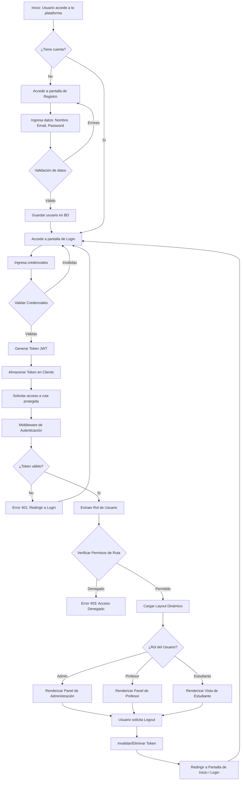
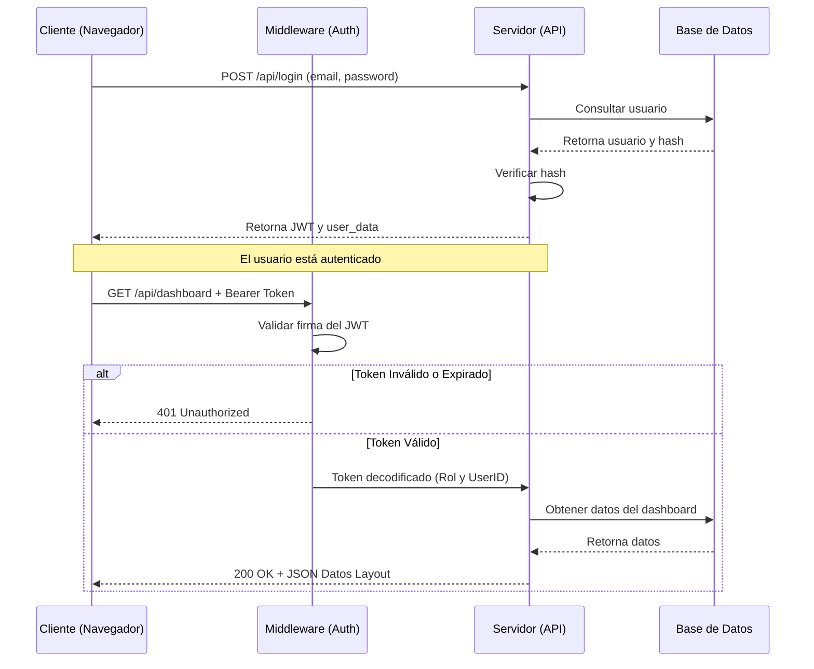

# Diagramas de Flujo del Sistema

Este documento presenta los diagramas de flujo modelados mediante Mermaid, detallando el ciclo de vida de la autenticación y autorización en la aplicación web.

## 1. Flujo General de Autenticación y Layout Dinámico

El siguiente diagrama muestra el recorrido completo desde que un usuario intenta acceder al sistema hasta que se le presenta el layout correspondiente a su rol, o bien cierra su sesión.

## 2. Diagrama de Secuencia: Validación y Middleware

Detalle específico de la interacción entre el cliente, el middleware y la base de datos durante una petición segura.

