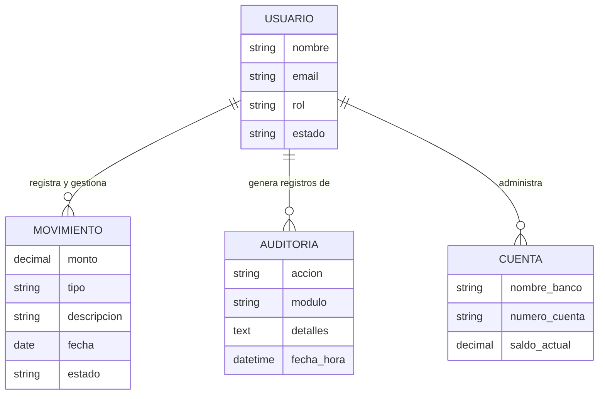

# Diagrama Entidad-Relación (Conceptual) - Academia Conduser

Este diagrama representa la lógica de negocio y las relaciones de alto nivel entre las entidades principales del sistema.

### Descripción del Modelo:
*   **USUARIO**: Es la entidad central (Root, Administrador o Colaborador).
*   **MOVIMIENTO**: Representa el flujo de caja (Ingresos, Egresos, Comisiones, Descuentos).
*   **AUDITORIA**: Registra la trazabilidad de seguridad de cada usuario.
*   **CUENTA**: Gestiona los diferentes depósitos o bancos donde se mueve el dinero.
