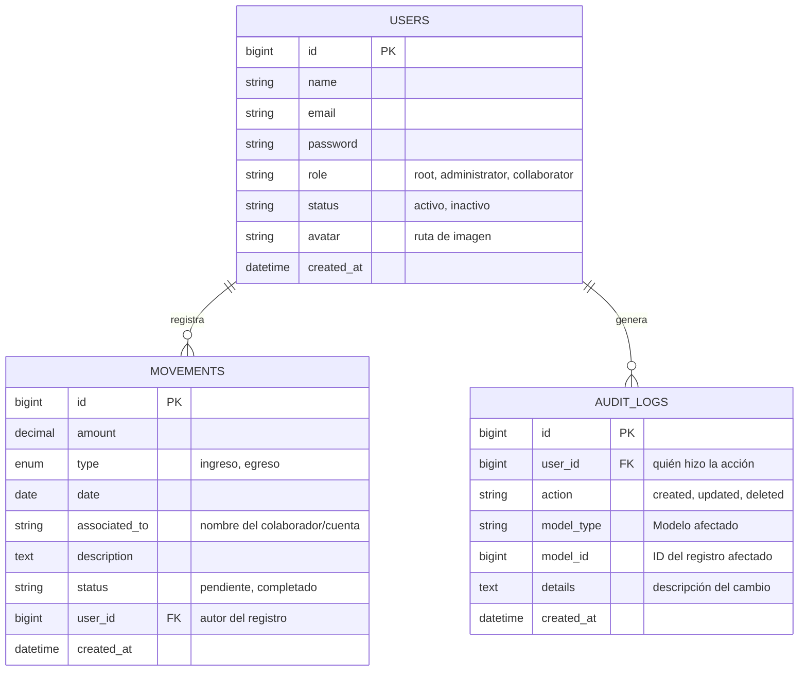

# Diagrama Entidad-Relación (ERD) - Academia Conduser

Este diagrama muestra cómo se relacionan los datos en la base de datos del proyecto.

### Explicación de las Relaciones:
1.  **Usuarios ➔ Movimientos**: Un usuario (administrador o colaborador) puede registrar muchos movimientos financieros. Cada movimiento pertenece obligatoriamente a un usuario.
2.  **Usuarios ➔ Auditoría**: Cada vez que un usuario hace un cambio importante, se genera un registro en la tabla de auditoría vinculado a su ID.
3.  **Movimientos**: Son el núcleo de la aplicación, guardando montos, tipos y estados para el flujo de caja.
