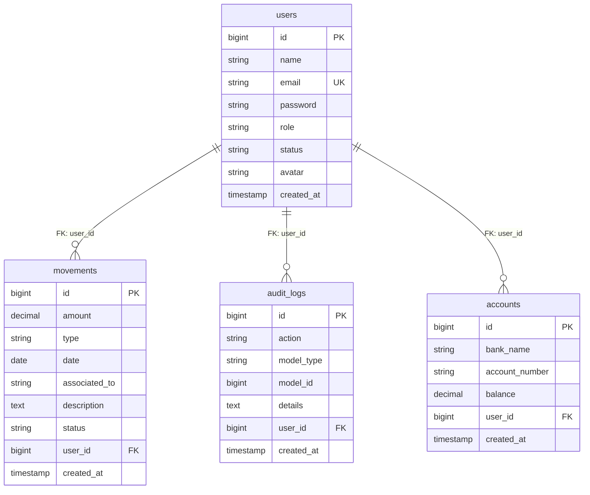

# Modelo Relacional Lógico (Técnico) - Academia Conduser

Este diagrama detalla la estructura física de la base de datos, incluyendo tablas, llaves primarias (PK), llaves foráneas (FK) y tipos de datos exactos.

### Detalles Técnicos:
1.  **Tablas**: Representan la implementación física en MySQL.
2.  **Llaves (PK/FK)**: Garantizan la integridad referencial. Por ejemplo, si se borra un usuario, sus movimientos se eliminan en cascada (`onDelete: cascade`).
3.  **Restricciones**: El campo `email` en la tabla `users` es único (`UK`) para evitar duplicados.
4.  **Trazabilidad**: Todas las tablas incluyen `timestamps` (`created_at`, `updated_at`) para control de auditoría temporal.
